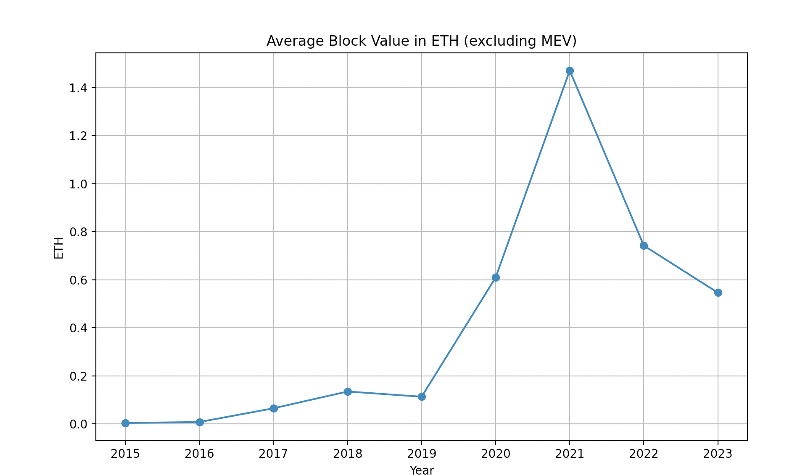

# Ethereum Block Analysis

### NOTE: All the data used in this code was from Etherscan 

Plots the following mean average properties of Ethereum's block:

|  |  |
|  |  |
|  |  |
|  |

## Reproduction 
Make sure you have python >= 3 installed. 

Install the dependencies and run the main.py file.

## License
# MIT
